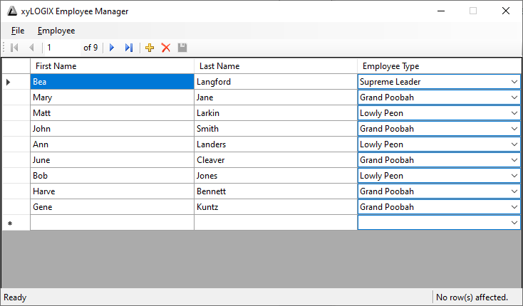

**Hi, readers!  Help yourself to this code and tutorial!**

**Unfortunately, at the date I created this sample, I had other priorities, so this is it for the README.md for now.  I plan on writing up a full walkthrough article at some point, in order to explain how to do this process in further detail.  For now, enjoy this repository and I hope you learn something from the code -- it's very well-documented!**

# EmployeeManager sample

**Figure 1.** Screenshot of the main window of the application.

Illustrates how to create a .mdf database file in Visual Studio 2019, generate a Entity Framework ORM data model for it, scaffold it with a Repository/Unit of Work pattern, and then write a Windows Forms graphical application in order to allow a non-skilled user to manipulate the data.

Putting all the infrastructure discussed above into place makes coding a Windows Forms app (or any other user-friendly presentation layer) very easy -- it boils down to, essentially, just three calls:

* `InitializeAll()` to bring up the connection to the data source;
* `GetAll()` to fetch all the records from the data source for display; and
* `SaveAll()` to save any changes (creates/updates/deletes) to the data source after the user has manipulated the data in the GUI.

So why yet another data sample, you ask?  Because this one has the added benenfit of teaching the use of the full power of T4 Text Template (`.tt`) files to enable generation of the stuff we don't want to have to write ourselves when tables are generated in the database and ORM -- basically, we create new `.tt` files that scaffold our Repository / Unit of Work layer for us, and also set up databinding.  These files do the heavy lifting and continue to do so as our database grows and changes.

## Things I missed

My emphasis for this particular project was producing the `EmployeeManager.BusinessLayer.tt` and `EmployeeManager.DataBinding.tt` files, so I can do more of a 'just add water' approach to getting a database wired up to a UI/UX.  The `EmployeeManager.BusinessLayer.tt` has some definicies, such as:

* Very naive thread syncrhonization
* No support for database transactions or concurrency (beyond the default)
* Only handles Microsoft SQL Server database (no SQLite, Oracle PL/SQL, PostgreSQL etc)

The `EmployeeManager.Databinding.tt` file was built using the [walkthrough posted here](https://docs.microsoft.com/en-us/ef/ef6/fundamentals/databinding/winforms).  It simply generates the class in question.  It's a way to just drop-in the code.

Really, the `EmployeeManager.BusinessLayer.tt` file should be broken up so that all interfaces are generated by one `.tt` file, all the concrete `*Service` classes are generated by another `.tt` file, all the concreate Repository classes are generated by their own `.tt` file etc. so that all the components can, in principle, be hosued in separate C# class library projects.  There is also no breakdown of the Solution (.sln) into Class Libraries for the Data Layer, Business Logic Layer etc. as is normally the best-practice. I find that is an essential part of developing quality, enterprise-scale software.  But in ginning up this sample, my primary purpose was actually for research purposes, just to see what it would take to implement a business logic layer for a WinForms application that came from a drop-in `EmployeeManager.BusinessLayer.tt` file.

There is a [different T4 Template file posted here, as a Gist](https://gist.github.com/astrohart/e693885e3a9e8054fb7f27cf8e8ebeb7) that is a generic `BusinessLayer.tt` file that can be adapted to function in a Windows Service application or a ASP.NET MVC project or what have you.  It's fully documented (as is the code for this sample).  The Gist was created solely by myself.

There is also a [generic WinForms Business Layer T4 template Gist](https://gist.github.com/astrohart/234e9662039d386649c23ca50af3ac38), again, solely created by myself, that I derived the `EmployeeManager.BusinessLayer.tt` file from.
